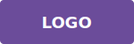

# 🎨 Guía de Personalización

Esta guía te ayudará a personalizar tu sitio web según tus necesidades.

## 📝 Cambiar Información del Sitio

### 1. Cambiar Título del Sitio

En `index.html`, línea 6:
```html
<title>Sitio Web Profesional</title>
<!-- Cambiar a tu título -->
<title>Mi Negocio Profesional</title>
```

### 2. Cambiar de la Pantalla de Bienvenida

En `index.html`, línea 86-90:
```html
<div class="banner-overlay">
    <h1>Bienvenido a Nuestro Sitio</h1>
    <p>Soluciones profesionales para tu negocio</p>
</div>
```

Cambiar a:
```html
<div class="banner-overlay">
    <h1>Tu Título Aquí</h1>
    <p>Tu descripción aquí</p>
</div>
```

## 🖼️ Reemplazar Imágenes

### Logo
1. Diseña o descarga tu logo (mínimo 150x50px, puede ser mayor)
2. Convierte a PNG o SVG
3. Guarda en `img/logo.png` o `img/logo.svg`
4. En `index.html` línea 32, cambia:
```html

```

### Banner
1. Prepara tu imagen (recomendado: 1200x400px)
2. Convierte a JPG para mejor compresión o SVG
3. Guarda en `img/banner.jpg` o `img/banner.svg`
4. En `index.html` línea 86, cambia:
```html

```

## 🎯 Cambiar Colores Principales

En `styles.css`, modifica las variables de `:root`:

```css
:root {
    --primary-color: #1a3a4a;      /* Azul oscuro - cambia aquí */
    --secondary-color: #6b4c9a;    /* Púrpura - cambia aquí */
    --accent-color: #e8a87c;       /* Naranja/Dorado - cambia aquí */
    --text-color: #333;             /* Texto principal */
    --light-text: #666;             /* Texto secundario */
    --bg-light: #f5f5f5;            /* Fondo claro */
    --white: #ffffff;               /* Blanco */
}
```

### Paletas de Colores Recomendadas:

**Opción 1 - Profesional Azul:**
```css
--primary-color: #0d47a1;
--secondary-color: #1565c0;
--accent-color: #ffc107;
```

**Opción 2 - Verde Moderno:**
```css
--primary-color: #1b5e20;
--secondary-color: #388e3c;
--accent-color: #ff6f00;
```

**Opción 3 - Rosa Profesional:**
```css
--primary-color: #880e4f;
--secondary-color: #c2185b;
--accent-color: #00bcd4;
```

## ✏️ Editar Contenido de Secciones

### Cambiar Texto de Secciones

Localiza la sección en `index.html` y edita directamente:

```html
<!-- SECCIÓN 2: PROBLEMAS -->
<section class="section section-alt" id="problemas">
    <div class="container">
        <h2>Problemas</h2>
        <p>Tu nuevo texto aquí...</p>
```

### Agregar/Eliminar Cards en Problemas

Para agregar más cards:

```html
<div class="cards-grid">
    <div class="card">
        <i class="fas fa-chart-line"></i>
        <h3>Tu Problema</h3>
        <p>Descripción del problema</p>
    </div>
</div>
```

Cambia el icono reemplazando `fas fa-chart-line` por otros de [Font Awesome](https://fontawesome.com/icons).

## 🔧 Personalizar Servicios

En la sección de Servicios (línea ~250):

```html
<div class="service">
    <i class="fas fa-laptop"></i>
    <h3>Tu Servicio</h3>
    <p>Descripción del servicio</p>
</div>
```

Ejemplos de iconos:
- `fas fa-code` - Código
- `fas fa-smartphone` - Móvil
- `fas fa-rocket` - Rápido
- `fas fa-shield-alt` - Seguridad
- `fas fa-database` - Base de datos

## 📋 Configurar Formulario

El formulario de contacto está en la sección Contacto. Para hacerlo funcional:

### Opción 1: Enviar a Email (con Formspree)

1. Ve a [formspree.io](https://formspree.io)
2. Crea una cuenta y nuevo formulario
3. En `script.js`, reemplaza el manejador del formulario:

```javascript
contactForm.addEventListener('submit', function(e) {
    e.preventDefault();
    
    // Enviar a Formspree
    fetch('https://formspree.io/f/TU_ID', {
        method: 'POST',
        body: new FormData(this),
        headers: { 'Accept': 'application/json' }
    }).then(response => {
        if (response.ok) {
            alert('¡Mensaje enviado exitosamente!');
            this.reset();
        }
    });
});
```

### Opción 2: Agregar Método POST

Si tienes tu propio servidor, en `script.js`:

```javascript
fetch('/tu-api/contacto', {
    method: 'POST',
    headers: { 'Content-Type': 'application/json' },
    body: JSON.stringify({ nombre, email, mensaje })
}).then(response => response.json())
  .then(data => console.log('Éxito:', data))
  .catch(error => console.error('Error:', error));
```

## 🔗 Agregar Enlaces de Redes Sociales

En el footer (línea ~320), personaliza los enlaces:

```html
<div class="social-links">
    <a href="https://facebook.com/tupagina" class="social-icon">
        <i class="fab fa-facebook"></i>
    </a>
    <a href="https://twitter.com/tuusuario" class="social-icon">
        <i class="fab fa-twitter"></i>
    </a>
    <a href="https://linkedin.com/company/tuempresa" class="social-icon">
        <i class="fab fa-linkedin"></i>
    </a>
    <a href="https://instagram.com/tuusuario" class="social-icon">
        <i class="fab fa-instagram"></i>
    </a>
</div>
```

## 🌐 Agregar Nuevas Secciones

Para agregar una sección completamente nueva:

1. En `index.html`, agrega antes del footer:
```html
<!-- NUEVA SECCIÓN -->
<section class="section" id="mi-nueva-seccion">
    <div class="container">
        <h2>Título de Mi Nueva Sección</h2>
        <p>Contenido aquí...</p>
    </div>
</section>
```

2. Agrega el enlace en el menú:
```html
<li><a href="#mi-nueva-seccion">Mi Nueva Sección</a></li>
```

3. ¡Listo! La navegación suave y responsiva funcionarán automáticamente.

## 📱 Ajustar Media Queries

Si necesitas cambiar los puntos de quiebre responsivos en `styles.css`:

```css
/* Tablets - cambiar de 768px a otro valor */
@media (max-width: 768px) {
    /* ... estilos tablet ... */
}

/* Móviles - cambiar de 480px a otro valor */
@media (max-width: 480px) {
    /* ... estilos móvil ... */
}
```

## 🎯 Cambiar Tipografía

Para usar Google Fonts:

1. Ve a [Google Fonts](https://fonts.google.com)
2. Selecciona tu fuente
3. Copia el código de importación
4. En `index.html` dentro de `<head>` agrega:
```html
<link href="https://fonts.googleapis.com/css2?family=TuFuente:wght@400;600;700&display=swap" rel="stylesheet">
```

5. En `styles.css` cambia:
```css
body {
    font-family: 'Tu Fuente', sans-serif;
}
```

## ⚡ Optimizaciones Avanzadas

### Comprimir Imágenes
- Usa [TinyPNG](https://tinypng.com) para comprimir fotos
- Usa [SVGOMG](https://jakearchibald.github.io/svgomg/) para optimizar SVGs

### Mejorar Velocidad
- Reemplaza Font Awesome CDN con SVG inline si lo necesitas
- Optimiza imágenes antes de subirlas
- Minifica archivos CSS/JS en producción

### SEO
- Cambia el `<title>` con palabras clave
- Agrega `<meta name="description">` en el `<head>`
- Usa etiquetas semánticas (ya incluidas)

## 🆘 Solución de Problemas

### Las imágenes no se cargan
1. Verifica que estén en la carpeta `img/`
2. Revisa que el nombre sea exacto (mayúsculas/minúsculas importan)
3. Los archivos deben ser: `.png`, `.jpg`, `.svg`

### El menú no responde en móvil
1. Asegúrate de que `script.js` está cargado
2. Abre la consola (F12) y revisa errores
3. Verifica que la clase `menu-toggle` tenga `id="menuToggle"`

### Los estilos no se aplican
1. Guarda `styles.css` con UTF-8
2. Recarga la página (Ctrl+Shift+R para limpiar cache)
3. Revisa que el archivo esté en la misma carpeta que `index.html`

## 📚 Recursos Útiles

- [MDN Web Docs](https://developer.mozilla.org/) - Documentación oficial
- [CSS Tricks](https://css-tricks.com/) - Tutoriales CSS
- [JavaScript.info](https://javascript.info/) - Tutoriales JavaScript
- [Prettier](https://prettier.io/) - Formateador de código
- [Color Hunt](https://colorhunt.co/) - Paletas de colores

---

¡Diviértete personalizando tu sitio! 🚀
