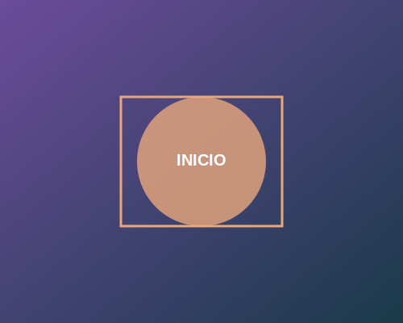

# 📸 Guía: Cómo Reemplazar las Imágenes

## Imágenes por Sección

Todas las secciones ahora tienen placeholders de imágenes que puedes reemplazar con tus propias imágenes. Aquí está el mapping:

| Sección | Archivo | Ubicación en HTML | Recomendación |
|---------|---------|-------------------|---|
| **Inicio** | `img/inicio.svg` | Lado derecho | 500x400px |
| **Problemas** | `img/problemas.svg` | Arriba del contenido | 1200x300px |
| **Mercado** | `img/mercado.svg` | Lado derecho | 500x400px |
| **Enfoque** | `img/enfoque.svg` | Lado izquierdo | 500x400px |
| **Servicios** | `img/servicios.svg` | Arriba del contenido | 1200x300px |
| **Modelo** | `img/modelo.svg` | Lado derecho | 500x400px |
| **Beneficios** | `img/beneficios.svg` | Lado izquierdo | 500x400px |
| **Contacto** | `img/contacto.svg` | Arriba del contenido | 1200x300px |

## 🎯 2 Escenarios de Imágenes

### Escenario 1: Imágenes Lado a Lado (Con Texto)
**Secciones:** Inicio, Mercado, Modelo, Beneficios (Enfoque)

Estructura HTML:
```html
<div class="section-with-image">
    <div class="section-content">
        <!-- Contenido: título, párrafos, lists -->
    </div>
    <div class="section-image">
        
    </div>
</div>
```

**Cómo reemplazar:**
1. Prepara tu imagen en formato PNG, JPG o SVG
2. Tamaño recomendado: **500x400px** para mejor rendimiento
3. Guarda en `img/` con el nombre indicado
4. Reemplaza el archivo SVG existente

**Ejemplo:**
```
Antes: 
Después: 
```

### Escenario 2: Imágenes Arriba (Full-width)
**Secciones:** Problemas, Servicios, Contacto

Estructura HTML:
```html
<div class="section-image-top">
    
</div>
<!-- Contenido debajo -->
```

**Cómo reemplazar:**
1. Prepara tu imagen (PNG, JPG o SVG)
2. Tamaño recomendado: **1200x300px** o más ancho
3. Guarda en `img/` con el nombre indicado
4. Reemplaza el archivo SVG existente

## 🔄 Formato de Imágenes Recomendadas

### PNG
- **Ventajas:** Sin pérdida de calidad, transparencia
- **Desventajas:** Archivo más grande
- **Mejor para:** Logos, imágenes con transparencia
- **Tamaño:** Comprime con [TinyPNG](https://tinypng.com)

### JPG
- **Ventajas:** Archivo más pequeño, buena calidad
- **Desventajas:** Compresión con pérdida
- **Mejor para:** Fotos, imágenes complejas
- **Tamaño:** Comprime con [CompressJPEG](https://compressjpeg.com)

### SVG
- **Ventajas:** Escalable sin perder calidad, muy ligero
- **Desventajas:** No ideal para fotos complejas
- **Mejor para:** Ilustraciones, íconos, gráficos
- **Tamaño:** Optimiza con [SVGOMG](https://jakearchibald.github.io/svgomg/)

## 📐 Dimensiones por Tipo

### Imágenes Lado a Lado
- Mínimo: **300x250px**
- Recomendado: **500x400px**
- Máximo: **700x600px**

### Imágenes Top (Full-width)
- Mínimo: **800x200px**
- Recomendado: **1200x300px**
- Máximo: **1400x400px**

## ✅ Paso a Paso: Cambiar una Imagen

### Ejemplo: Cambiar imagen de Inicio

1. **Descarga o prepara tu imagen**
   - Por ejemplo: `mi-imagen-inicio.jpg`

2. **Guarda en la carpeta `img/`**
   ```
   portafolio prueba/
   └── img/
       ├── inicio.jpg  ← Reemplaza este archivo
       └── ... otras imágenes
   ```

3. **(Opcional) Actualiza la referencia en `index.html`**
   
   Busca alrededor de la línea 48:
   ```html
   
   ```
   
   Si cambiaste a un archivo distinto:
   ```html
   
   ```

4. **Recarga el navegador (Ctrl+Shift+R)**

¡Listo! Tu imagen aparecerá automáticamente.

## 🎨 Opciones por Sección

### Sección Inicio
- Logo en acción
- Persona trabajando
- Concepto de éxito
- Gráfico de crecimiento

### Sección Problemas
- Ilustración de desafíos
- Gráfico de problemas comunes
- Embudo de conversión
- Estadísticas

### Sección Mercado
- Mercado objetivo
- Gráfico de mercado
- Personas del público objetivo
- Mapa de mercado

### Sección Enfoque
- Equipo trabajando
- Brainstorm
- Estrategia visual
- Enfoque en el cliente

### Sección Servicios
- Galería de servicios
- Herramientas de trabajo
- Tipos de servicios
- Portfolio

### Sección Modelo
- Diagrama de modelo
- Flujo de negocio
- Estructura organizacional
- Ciclo de vida

### Sección Beneficios
- Checklist visual
- Iconografía de beneficios
- Testimonio visual
- Garantías

### Sección Contacto
- Formulario visual
- Datos de contacto
- Llamada a la acción
- Mapa

## 🔧 Optimización Rápida

**Para acelerar carga:**
```bash
# Comprimir PNG
1. Sube a https://tinypng.com
2. Descarga el archivo comprimido

# Comprimir JPG
1. Sube a https://compressjpeg.com
2. Selecciona "Reducir calidad"
3. Descarga

# Optimizar SVG
1. Sube a https://jakearchibald.github.io/svgomg/
2. Copia el SVG optimizado
```

## ⚡ Bonus: Agregar más Imágenes

Si quieres agregar **múltiples imágenes por sección**, duplica el bloque:

```html
<div class="section-image">
    
</div>
```

Y ajusta el CSS en `styles.css`:

```css
.section-with-image {
    grid-template-columns: 1fr 1fr 1fr; /* Para 3 imágenes */
}
```

## 🆘 Solución de Problemas

### La imagen no se ve
- ✓ Verifica que el archivo esté en la carpeta `img/`
- ✓ Revisa que la ruta sea igual en HTML: `./img/nombre.jpg`
- ✓ Revisa mayúsculas/minúsculas del nombre
- ✓ Recarga con Ctrl+Shift+R

### La imagen se ve distorsionada
- ✓ Usa proporciones 1:0.8 (ancho:alto)
- ✓ No hagas muy pequeñas las imágenes
- ✓ En CSS, `object-fit: cover` recorta la imagen

### La página carga lenta
- ✓ Comprime tus imágenes (máximo 300KB cada una)
- ✓ Usa JPG para fotos, PNG para gráficos
- ✓ Considera usar SVG para ilustraciones

---

¡Diviértete personalizando con tus imágenes! 🎉
